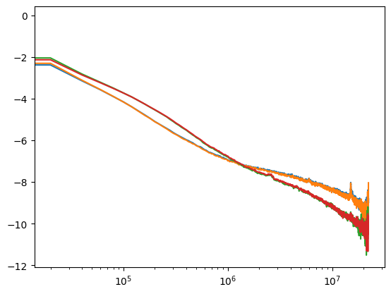

# ДЗ 4
## Фатахов Георгий группа 1


#### Информация и атрибуты матрицы Hi-C 

HiC1.dm3.mapq_30.1000.mcool
```
{
  'bin-size': 20000,
  'bin-type': 'fixed',
  'creation-date': '2023-04-06T04:39:00.281457',
  'format': 'HDF5::Cooler',
  'format-url': 'https://github.com/open2c/cooler',
  'format-version': 3,
  'generated-by': 'cooler-0.8.11',
  'genome-assembly': 'unknown',
  'metadata': {},
  'nbins': 6024,
  'nchroms': 7,
  'nnz': 7122786,
  'storage-mode': 'symmetric-upper',
  'sum': 63912926
}
```
HiC2.dm3.mapq_30.1000.mcool
```
{
  'bin-size': 20000,
  'bin-type': 'fixed',
  'creation-date': '2023-04-06T04:16:47.610855',
  'format': 'HDF5::Cooler',
  'format-url': 'https://github.com/open2c/cooler',
  'format-version': 3,
  'generated-by': 'cooler-0.8.11',
  'genome-assembly': 'unknown',
  'metadata': {},
  'nbins': 6024,
  'nchroms': 7,
  'nnz': 7386462,
  'storage-mode': 'symmetric-upper',
  'sum': 61819050
}
```
HiC3.dm3.mapq_30.1000.mcool
```
{
  'bin-size': 20000,
  'bin-type': 'fixed',
  'creation-date': '2023-04-06T04:23:11.844138',
  'format': 'HDF5::Cooler',
  'format-url': 'https://github.com/open2c/cooler',
  'format-version': 3,
  'generated-by': 'cooler-0.8.11',
  'genome-assembly': 'unknown',
  'metadata': {},
  'nbins': 6024,
  'nchroms': 7,
  'nnz': 4852836,
  'storage-mode': 'symmetric-upper',
  'sum': 62878716
}
```
HiC4.dm3.mapq_30.1000.mcool
```
{
  'bin-size': 20000,
  'bin-type': 'fixed',
  'creation-date': '2023-04-06T04:53:24.060433',
  'format': 'HDF5::Cooler',
  'format-url': 'https://github.com/open2c/cooler',
  'format-version': 3,
  'generated-by': 'cooler-0.8.11',
  'genome-assembly': 'unknown',
  'metadata': {},
  'nbins': 6024,
  'nchroms': 7,
  'nnz': 5689703,
  'storage-mode': 'symmetric-upper',
  'sum': 74497702
}
```
 

#### Сooler как сбалансированная матрица для внутрихромосомных контактов

В качестве хромосомы была выбрана  `chrX`.

HiC1.dm3.mapq_30.1000.mcool

```
 array([[           nan,            nan,            nan, ...,
                   nan,            nan,            nan],
       [           nan, 8.80222344e-01, 1.39400366e-01, ...,
        6.26397784e-04, 0.00000000e+00,            nan],
       [           nan, 1.39400366e-01, 1.05905908e+00, ...,
        0.00000000e+00, 0.00000000e+00,            nan],
       ...,
       [           nan, 6.26397784e-04, 0.00000000e+00, ...,
        1.16384403e+00, 1.34611360e-01,            nan],
       [           nan, 0.00000000e+00, 0.00000000e+00, ...,
        1.34611360e-01, 2.77069541e+00,            nan],
       [           nan,            nan,            nan, ...,
                   nan,            nan,            nan]])
```

#### Таблица с координатами и контактами


```
[        chrom1    start1      end1 chrom2    start2      end2  count
 6703639   chrX         0     20000   chrX         0     20000    227
 6703640   chrX         0     20000   chrX     20000     40000     53
 6703641   chrX         0     20000   chrX     40000     60000      6
 6703642   chrX         0     20000   chrX     60000     80000      1
 6703643   chrX         0     20000   chrX     80000    100000      4
 ...        ...       ...       ...    ...       ...       ...    ...
 7122780   chrX  22380000  22400000   chrX  22400000  22420000    162
 7122781   chrX  22380000  22400000   chrX  22420000  22422827     14
 7122782   chrX  22400000  22420000   chrX  22400000  22420000   1694
 7122783   chrX  22400000  22420000   chrX  22420000  22422827     27
 7122784   chrX  22420000  22422827   chrX  22420000  22422827    244
 
 [419146 rows x 7 columns],
         chrom1    start1      end1 chrom2    start2      end2  count
 6971989   chrX         0     20000   chrX         0     20000    216
 6971990   chrX         0     20000   chrX     20000     40000     72
 6971991   chrX         0     20000   chrX     40000     60000     13
 6971992   chrX         0     20000   chrX     60000     80000      5
 6971993   chrX         0     20000   chrX     80000    100000      7
 ...        ...       ...       ...    ...       ...       ...    ...
 7386456   chrX  22380000  22400000   chrX  22400000  22420000    219
 7386457   chrX  22380000  22400000   chrX  22420000  22422827     13
 7386458   chrX  22400000  22420000   chrX  22400000  22420000   1537
 7386459   chrX  22400000  22420000   chrX  22420000  22422827     24
 7386460   chrX  22420000  22422827   chrX  22420000  22422827    160
 
 [414472 rows x 7 columns],
         chrom1    start1      end1 chrom2    start2      end2  count
 4449980   chrX         0     20000   chrX         0     20000     42
 4449981   chrX         0     20000   chrX     20000     40000     15
 4449982   chrX         0     20000   chrX     40000     60000      2
 4449983   chrX         0     20000   chrX     60000     80000      1
 4449984   chrX         0     20000   chrX     80000    100000      1
 ...        ...       ...       ...    ...       ...       ...    ...
 4852830   chrX  22380000  22400000   chrX  22400000  22420000    404
 4852831   chrX  22380000  22400000   chrX  22420000  22422827     36
 4852832   chrX  22400000  22420000   chrX  22400000  22420000   1681
 4852833   chrX  22400000  22420000   chrX  22420000  22422827     28
 4852834   chrX  22420000  22422827   chrX  22420000  22422827    195
 
 [402855 rows x 7 columns],
         chrom1    start1      end1 chrom2    start2      end2  count
 5246273   chrX         0     20000   chrX         0     20000     78
 5246274   chrX         0     20000   chrX     20000     40000     23
 5246275   chrX         0     20000   chrX     40000     60000      2
 5246276   chrX         0     20000   chrX     60000     80000      3
 5246277   chrX         0     20000   chrX    140000    160000      9
 ...        ...       ...       ...    ...       ...       ...    ...
 5689697   chrX  22380000  22400000   chrX  22400000  22420000    504
 5689698   chrX  22380000  22400000   chrX  22420000  22422827     41
 5689699   chrX  22400000  22420000   chrX  22400000  22420000   1872
 5689700   chrX  22400000  22420000   chrX  22420000  22422827     39
 5689701   chrX  22420000  22422827   chrX  22420000  22422827    207
 
 [443429 rows x 7 columns]]
 ```

 Нет она не сбаллансирована, т.к. вместо вероятности (веса) указаны просто количества (числа).

 #### Таблицу в командной строке командой *cooler dump*

 файл `output.tsv`

#### Столбцы таблицы с бинами

```['chrom', 'start', 'end', 'weight']```


- chrom - имя хромосомы
- start - начало бина
- end - конец бина
- weight: Вес бина при баллансировке, 


#### Кривые зависимости число контактов от расстояния для выбранной хромосомы


Видим что по две реплики сильно соглассованы

####  insulation score и границы тадов для всех реплик